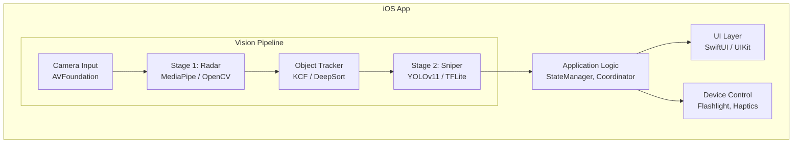
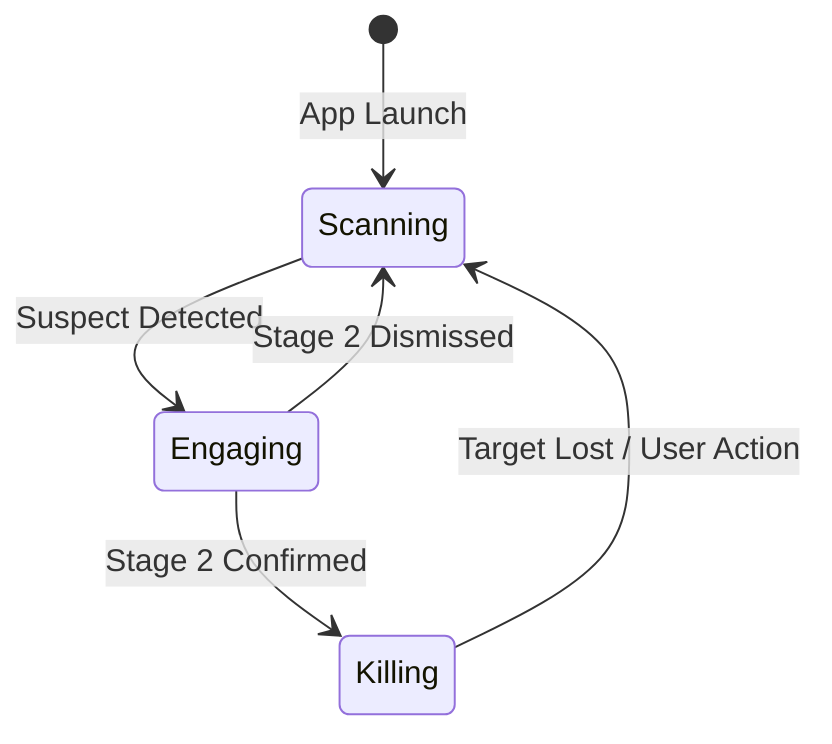

# Mosquito Finder (猎蚊者) 架构设计文档

## 1. 架构概览 (Architecture Overview)

本文档定义了 Mosquito Finder iOS 应用的技术架构，基于**两阶段检测法 (Two-Stage Detection)** 核心理念设计。架构目标是：
*   **高性能**: Stage 1 轻量快速，Stage 2 精准强大。
*   **低功耗**: 避免全时运行重型模型。
*   **模块化**: 易于迭代和替换核心算法（MediaPipe -> YOLOv11）。



---

## 2. 分层架构 (Layered Architecture)

### 2.1 表现层 (Presentation Layer)

| 模块 | 技术 | 职责 |
|------|------|------|
| `HuntingView` | SwiftUI | 主相机界面，渲染 HUD、准星、目标光圈 |
| `TargetOverlay` | SwiftUI Canvas / SpriteKit | 绘制动态黄色/红色光圈、波纹动画 |
| `PiPView` | AVPlayerLayer / UIImageView | 画中画特写区域 |

**设计要点**:
*   使用 `CADisplayLink` 或 SwiftUI `TimelineView` 驱动 60fps 动画。
*   光圈状态机：`.idle` -> `.suspect` (黄) -> `.confirmed` (红) -> `.dismissed` (灰)。

### 2.2 应用逻辑层 (Application Logic Layer)

| 模块 | 职责 |
|------|------|
| `HuntingStateManager` | 管理当前狩猎阶段 (Scanning / Engaging / Killing) |
| `TargetCoordinator` | 协调 Stage 1 输出、Tracker 追踪、Stage 2 确认 |
| `TriggerEvaluator` | 判断是否满足 Stage 2 触发条件 (变焦/靠近/对准) |

**状态流转**:



### 2.3 视觉处理层 (Vision Pipeline Layer)

这是核心算力层，分为三个子模块：

#### 2.3.1 Stage 1: Radar Detector

*   **输入**: 来自主摄 (1x Wide) 的实时 `CMSampleBuffer` 视频帧。
*   **处理**: 
    *   *初期*: MediaPipe Image Segmentation 或 Object Detection (低阈值)。
    *   *备选*: OpenCV `SimpleBlobDetector` / 高斯差分 (DoG)。
*   **输出**: `[SuspectRegion]` - 包含可疑点的屏幕坐标 (CGRect) 数组。
*   **性能目标**: < 30ms / frame (目标 30fps+)。

#### 2.3.2 Object Tracker

*   **输入**: `SuspectRegion` + 当前视频帧。
*   **处理**: 
    *   使用 KCF (Kernelized Correlation Filters) 或 OpenCV CSRT Tracker。
    *   当画面抖动时，持续更新目标位置。
*   **输出**: 稳定的 `TrackedTarget` 对象，包含当前位置、置信度、生命周期。

#### 2.3.3 Stage 2: Sniper Classifier

*   **触发条件**: 
    1.  `TrackedTarget` 进入屏幕中心区域 (Center ROI)。
    2.  用户手动变焦 >= 3x。
    3.  加速度计检测到"靠近"动作。
*   **输入**: 裁剪后的 ROI 图像 (e.g., 224x224 或 640x640)。
*   **处理**: 
    *   *初期*: MediaPipe Custom TFLite Model (自训练蚊子分类器)。
    *   *后期*: YOLOv11-Nano / YOLOv11-Small 精细检测。
*   **输出**: `ClassificationResult` - 类别 (Mosquito / NotMosquito) + 置信度。

---

## 3. 设备控制层 (Device Control Layer)

| 模块 | 技术 | 职责 |
|------|------|------|
| `FlashlightManager` | AVCaptureDevice | 控制闪光灯开关、亮度 |
| `HapticsEngine` | CoreHaptics | 触觉反馈：轻震 (发现)、强震 (确认) |
| `CameraController` | AVCaptureSession | 相机配置、镜头切换、对焦锁定 |
| `MotionDetector` | CoreMotion | 加速度计监测靠近动作 |

---

## 4. 关键技术实现

### 4.1 相机对焦控制 (Focus Locking)

```swift
// CameraController.swift
func lockFocusOnCenter() {
    guard let device = captureDevice else { return }
    try? device.lockForConfiguration()
    if device.isFocusModeSupported(.continuousAutoFocus) {
        device.focusPointOfInterest = CGPoint(x: 0.5, y: 0.5) // 屏幕中心
        device.focusMode = .continuousAutoFocus
    }
    device.unlockForConfiguration()
}
```

### 4.2 MediaPipe 集成方案

```swift
// Stage1Detector.swift
import MediaPipeTasksVision

class Stage1Detector {
    private var objectDetector: ObjectDetector?
    
    func setup() {
        let options = ObjectDetectorOptions()
        options.baseOptions.modelAssetPath = "blob_detector.tflite"
        options.scoreThreshold = 0.1 // 低阈值，高召回
        options.maxResults = 20
        objectDetector = try? ObjectDetector(options: options)
    }
    
    func detect(image: MPImage) -> [SuspectRegion] {
        guard let result = try? objectDetector?.detect(image: image) else {
            return []
        }
        return result.detections.map { SuspectRegion(from: $0.boundingBox) }
    }
}
```

### 4.3 触发条件评估

```swift
// TriggerEvaluator.swift
struct TriggerEvaluator {
    func shouldActivateStage2(
        target: TrackedTarget,
        zoomFactor: CGFloat,
        acceleration: CMAcceleration,
        screenCenter: CGRect
    ) -> Bool {
        // 条件 1: 目标在中心区域
        let isInCenter = screenCenter.contains(target.center)
        
        // 条件 2: 变焦 >= 3x
        let isZoomedIn = zoomFactor >= 3.0
        
        // 条件 3: 正在靠近 (Z轴加速度)
        let isApproaching = acceleration.z < -0.3
        
        // 条件 4: 目标像素足够大
        let isBigEnough = target.size.width >= 50 && target.size.height >= 50
        
        return (isInCenter || isZoomedIn || isApproaching) && isBigEnough
    }
}
```

---

## 5. 数据模型 (Data Models)

```swift
// Models.swift

/// Stage 1 输出的可疑区域
struct SuspectRegion: Identifiable {
    let id = UUID()
    var boundingBox: CGRect
    var confidence: Float
    var timestamp: Date
}

/// 被追踪的目标
struct TrackedTarget: Identifiable {
    let id: UUID
    var boundingBox: CGRect
    var trackingConfidence: Float
    var state: TargetState
    var lastUpdated: Date
}

enum TargetState {
    case suspect    // 黄色光圈
    case engaging   // 正在确认中
    case confirmed  // 红色锁定
    case dismissed  // 灰色叉号
}

/// Stage 2 分类结果
struct ClassificationResult {
    let isMosquito: Bool
    let confidence: Float
    let processingTime: TimeInterval
}
```

---

## 6. 项目目录结构 (Project Structure)

```
Mosquito-finder/
├── App/
│   ├── MosquitoFinderApp.swift
│   └── AppDelegate.swift
├── Presentation/
│   ├── Views/
│   │   ├── HuntingView.swift
│   │   ├── TargetOverlay.swift
│   │   └── PiPView.swift
│   └── ViewModels/
│       └── HuntingViewModel.swift
├── Domain/
│   ├── HuntingStateManager.swift
│   ├── TargetCoordinator.swift
│   └── TriggerEvaluator.swift
├── Vision/
│   ├── Stage1Detector.swift
│   ├── ObjectTracker.swift
│   └── Stage2Classifier.swift
├── Device/
│   ├── CameraController.swift
│   ├── FlashlightManager.swift
│   ├── HapticsEngine.swift
│   └── MotionDetector.swift
├── Models/
│   └── Models.swift
├── Resources/
│   ├── blob_detector.tflite
│   └── mosquito_classifier.tflite
└── docs/
    ├── 需求文档.md
    └── 架构设计文档.md
```

---

## 7. 依赖与第三方库

| 库 | 用途 | 备注 |
|----|------|------|
| **MediaPipeTasksVision** | Stage 1 检测、Stage 2 分类 | 核心视觉栈 |
| **OpenCV** (可选) | SimpleBlobDetector, CSRT Tracker | 可作为 MediaPipe 备选方案 |
| **YOLOv11 TFLite** (后期) | Stage 2 高精度检测 | Phase 3 集成 |

---

## 8. 性能预算 (Performance Budget)

| 阶段 | 目标帧率 | 处理时间/帧 | 内存占用 |
|------|----------|-------------|----------|
| Stage 1 (Radar) | 30 fps | < 33ms | < 100MB |
| Stage 2 (Sniper) | 15 fps (ROI only) | < 66ms | < 150MB |
| 总计 (Peak) | - | - | < 250MB |
